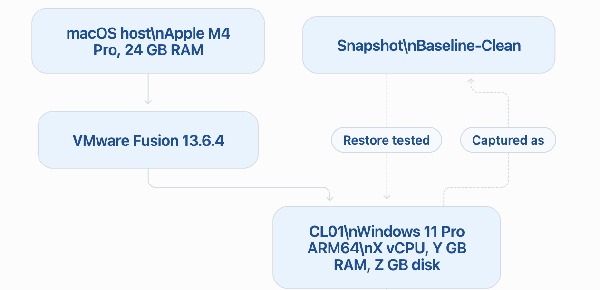

# L001 — Windows 11 VM Baseline

## 1. Lab metadata

| Field | Value |
|---|---|
| Lab ID | L001 |
| Date completed | 2026-09-12 |
| Host device | MacBook Pro, Apple M4 Pro, 24 GB RAM |
| Hypervisor | VMware Fusion 13.6.4 |
| Virtual machine | CL01 |
| Guest operating system | Windows 11 Pro ARM64 |
| Snapshot name | Baseline-Clean |

## 2. Objective

Build a reusable Windows 11 client virtual machine for Windows administration,
troubleshooting and support labs.

The baseline must provide:

- A working Windows 11 ARM64 installation.
- VMware Tools integration.
- Current Windows updates.
- Separate administrator and standard-user access.
- NAT network connectivity.
- A tested recovery snapshot.

## 3. Virtual machine configuration

| Component | Configured value | Verification method |
|---|---:|---|
| VM name in Fusion | `Windows 11 64-bit Arm` | VMware Fusion library |
| Windows hostname | `CL01` | `hostname` |
| Architecture | ARM64 | `Get-ComputerInfo` |
| vCPU | 4 | Fusion VM settings |
| Memory | 8GB | Fusion VM settings |
| Virtual disk | 64GB | Fusion VM settings |
| Network mode | `Share with my Mac / NAT` | Fusion Network Adapter settings |
| VMware Tools | Installed | Apps list and display integration |
| Snapshot | `Baseline-Clean` | Fusion Snapshot Manager |

## 4. Build summary

1. Downloaded Windows 11 Pro through **Get Windows from Microsoft** in VMware Fusion.
2. Created an ARM64 Windows virtual machine.
3. Assigned the documented CPU, memory, disk and network configuration.
4. Completed Windows 11 installation.
5. Installed VMware Tools and restarted Windows.
6. Renamed the Windows computer to `CL01`.
7. Installed all available Windows updates.
8. Configured administrator and standard-user access.
9. Created the `Baseline-Clean` snapshot.
10. Performed and verified a snapshot restore test.

## 5. Baseline system validation

The following commands were run in Windows PowerShell:

```powershell
hostname

Get-ComputerInfo -Property `
  CsName, `
  WindowsProductName, `
  WindowsVersion, `
  OsBuildNumber, `
  OsArchitecture, `
  CsNumberOfLogicalProcessors, `
  CsTotalPhysicalMemory

Get-NetIPConfiguration

Get-LocalUser | Select-Object Name, Enabled

Get-LocalGroupMember -Group "Administrators"
```

### Validation results

| Check | Expected result | Observed result | Status |
|---|---|---|---|
| Hostname | `CL01` | `CL01C` | PASS |
| Windows edition | Windows 11 Pro | `Windows 11 Pro` | PASS |
| Architecture | ARM64 / ARM-based | `ARM64` | PASS |
| VMware Tools | Installed and functional | Installed and functional | PASS |
| IPv4 address | Valid private IPv4 address | `172.16.53.128` | PASS |
| Default gateway | Gateway assigned by VMware NAT | `172.16.53.2` | PASS |
| Administrator account | At least one working administrator | `CL01` | PASS |
| Standard account | Working non-administrator account | `lab-standard` | PASS |
| Windows Update | No pending required updates or restart | `2026-09-12` | PASS |

## 6. Local account configuration

| Account | Account type | Enabled | Sign-in tested |
|---|---|---|---|
| `CL01` | Administrator | Yes | Yes |
| `lab-standard` | Standard user | Yes | Yes |

No passwords, PINs, product keys or recovery information are stored in this
repository.

## 7. Snapshot and restore test

### Snapshot

| Field | Value |
|---|---|
| Snapshot name | `Baseline-Clean` |
| Snapshot created | `<2026-09-13 00:04>` |
| VM state when captured | `running` |
| Baseline validation completed first | Yes |

### Test procedure

1. Booted `CL01` from the `Baseline-Clean` state.
2. Created a temporary file named `day02-restore-test.txt`.
3. Confirmed that the file existed.
4. Restored the VM to the `Baseline-Clean` snapshot.
5. Booted Windows again.
6. Confirmed that the temporary file no longer existed.
7. Revalidated hostname, accounts, network and Windows Update state.

### Post-restore validation

| Check | Baseline state | State after restore | Status |
|---|---|---|---|
| Temporary test file | Did not exist | Did not exist | PASS |
| Hostname | `CL01` | `CL01` | PASS |
| Administrator account | Present and enabled | `Present and enabled` | PASS |
| Standard account | Present and enabled | `Present and enabled` | PASS |
| Network configuration | NAT with valid IPv4 and gateway | `NAT with valid IPv4 and gateway` | PASS |
| Windows Update state | Baseline update state retained | `Baseline update state retained` | PASS |
| Windows boots normally | Yes | Yes | PASS |

The private IPv4 address `remained the same`.
The VM still retained a valid NAT configuration, default gateway and Internet
connectivity.

## 8. Lab topology



## 9. Outcome

The `CL01` Windows 11 Pro ARM64 virtual machine was successfully built,
validated and restored from the `Baseline-Clean` snapshot.

The VM is ready for subsequent Windows administration and troubleshooting labs.
